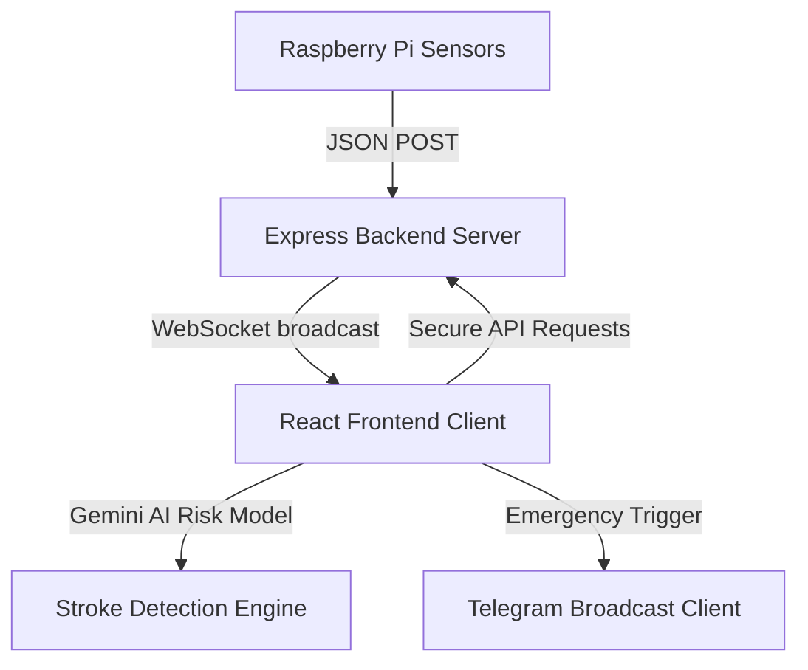

# 🧠 StrokeGuard AI

An advanced, premium-grade real-time early stroke detection and monitoring system. Features an ultra-modern dark glassmorphism dashboard, real-time sensor integration (via Raspberry Pi), interactive health profiling, AI-powered stroke risk analysis, and instantaneous automated telegram alert broadcasts.

---

## 🌟 Visual Overhaul & Aesthetics

StrokeGuard AI has been meticulously redesigned with an **ultra-premium dark medical-grade aesthetics theme**:
*   **Vibrant Accent Orbs**: Floating background gradients that add visual depth without compromising medical legibility.
*   **Glassmorphic Design System**: Modern translucent backdrops with subtle borders and heavy drop shadows (`backdrop-filter: blur()`).
*   **Dynamic Visual Elements**: Heartbeat pulse micro-animations, loading indicators, custom dark charts, and glowing active borders.
*   **Typography**: Clean sans-serif hierarchy powered by the *Inter* and *Space Grotesk* font families.

---

## 🛠 Tech Stack & Architecture

*   **Frontend**: React (v19) + Vite + TypeScript (fully type-safe)
*   **Styling**: Pure CSS Custom Design System + Modern utility helpers
*   **Backend**: Node.js Express + Socket.IO WebSockets (for live Pi stream)
*   **Database**: High-performance local flat-file storage (`backend/db.json` & browser state-saving fallback)
*   **Sensor Interface**: Python 3 (MPU6050 + MAX30102 via I²C on Raspberry Pi)



---

## 🚀 Quick Start

### 1. Prerequisiets
Ensure you have **Node.js (v18+)** installed.

### 2. Installation
Clone the repository and install all dependencies:
```bash
npm install
```

### 3. Running Development Environment
Start both the Express websocket backend server (port `5000`) and the Vite client (port `3000`) concurrently:
```bash
npm run dev
```
*   **Frontend Access**: [http://localhost:3000](http://localhost:3000)
*   **Backend API Port**: `http://localhost:5000`

---

## 📱 Component Architecture

### 1. 🔑 Auth System (`AuthPage.tsx`)
A secure interface featuring tab-switching design (Login vs Signup), password visibility toggles, glowing active input states, and complete integration with real backend APIs. Password hashing is done via `bcryptjs` and token authentication uses `jsonwebtoken (JWT)`.

### 2. 📋 Health Profiling Wizard (`HealthForm.tsx`)
A stunning 3-step interactive clinical wizard that collects:
1.  **Demographics**: Age, Gender, Residence, Work Type.
2.  **Clinical Factors**: Hypertension, Heart Disease, Diabetes, Smoking status.
3.  **Vitals Preview**: Live connection tracking.
Includes dynamic progress indicators and visual card selectors for a flawless user experience.

### 3. 📈 Vitals Dashboard (`SensorDashboard.tsx`)
A real-time analytics command center featuring:
*   **Pulse Monitoring**: Real-time heartbeat indicators.
*   **Live Charts**: Smooth Area and Line charts using Recharts for Heart Rate, SpO2, and Blood Pressure.
*   **IMU Telemetry**: Dedicated panels displaying Real-time Acceleration (X/Y/Z) and Gyroscope angular velocity.
*   **Seamless Fallbacks**: Automatically falls back to simulated sensor data if the Raspberry Pi isn't streaming, with clear live/simulated state badges.

### 4. 🧠 Risk Analysis Engine (`RiskAnalysis.tsx`)
An interactive analysis tool that visualizes stroke risk levels using:
*   An animated circular gradient gauge.
*   Risk-level color coding (Mild, Moderate, High, Severe).
*   Personalized preventative action plans.

### 5. 🚨 emergency Broadcasts (`AlertSystem.tsx`)
A vital component that listens for critical vital anomalies:
*   Triggers an animated warning modal when thresholds are exceeded.
*   Plays alert sequences to capture clinical attention.
*   Offers automated Telegram emergency broadcasting capability.

---

## 📡 Raspberry Pi Setup

To stream real sensor data from a physical device:
1.  Navigate to `raspberry_pi` directory.
2.  Install dependencies: `pip install -r requirements.txt`.
3.  Enable I²C interfaces via `raspi-config`.
4.  Run the sensor reader script:
    ```bash
    BACKEND_IP=YOUR_PC_IP_HERE python3 sensor_reader.py
    ```

---

## 🧪 Verification & Building
To check for type-safety:
```bash
npm run lint
```

To build production bundle:
```bash
npm run build
```
The optimized output is compiled into the `dist/` directory, ready to be hosted as static files.
